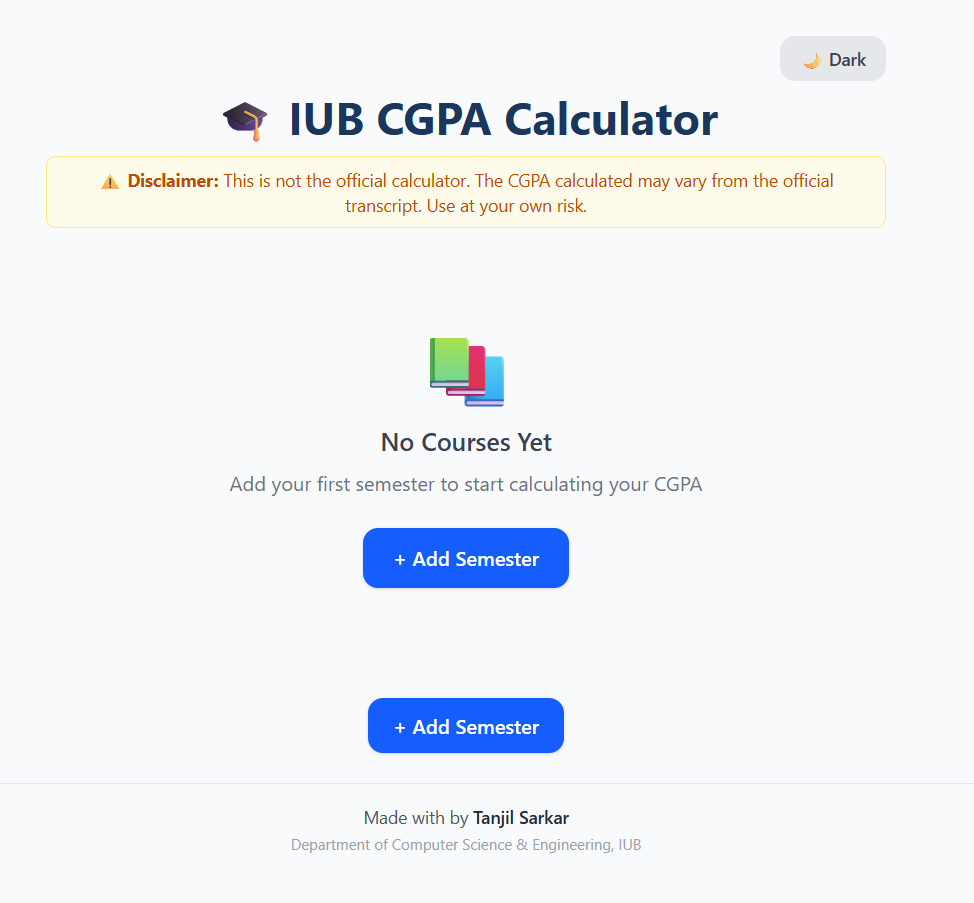
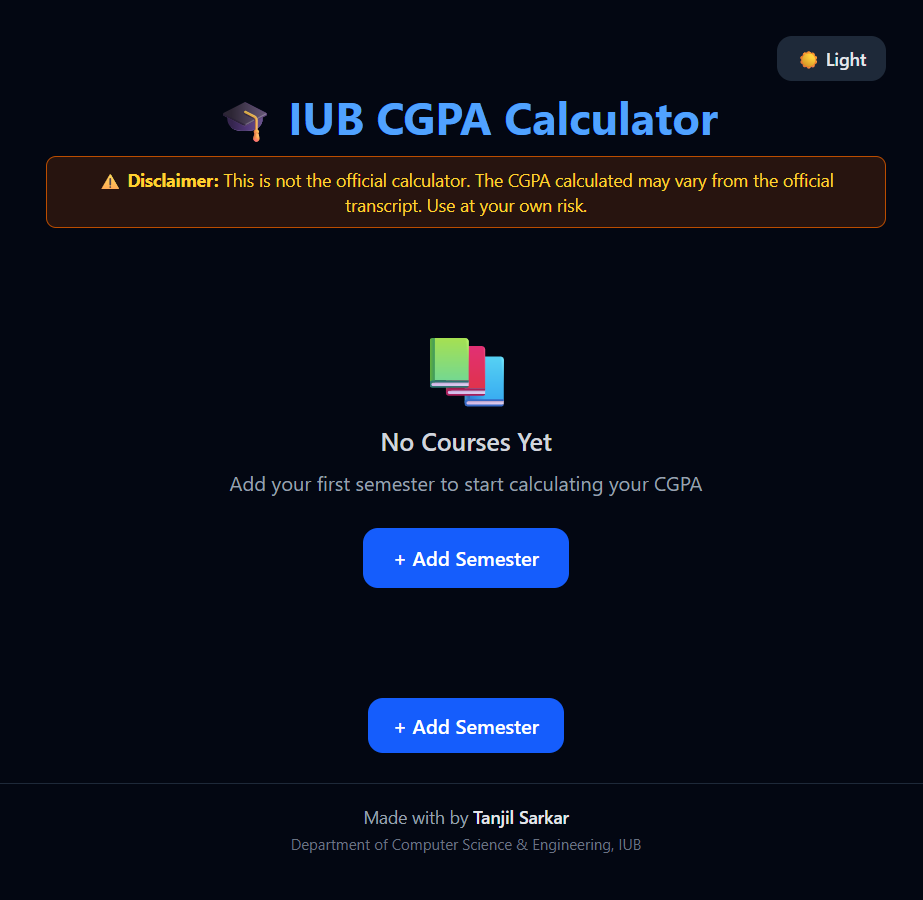

# IUB CGPA Calculator

<div align="center">


<br>

**Live Demo:** [iub-cgpa.vercel.app](https://iub-cgpa.vercel.app/)

</div>

---

## About

A modern, privacy-first CGPA calculator built for **IUB (Independent University, Bangladesh)** students. Calculate your SGPA and CGPA instantly with a clean, intuitive interface.

### Features

-  **Real-time CGPA calculation** — IUB grading scale (A=4.00, A-=3.70, B+=3.30, ...)
-  **Semester-wise organization** — Add multiple semesters with collapsible cards
-  **Dark mode** — Toggle between light and dark themes
-  **Export as PNG** — Download your CGPA report as an image
-  **What-If Simulator** — See what GPA you need to reach your target CGPA
-  **Auto-save** — Data persists in your browser (localStorage)
-  **Fully responsive** — Works on desktop, tablet, and mobile
-  **100% Private** — No signup, no backend, your data stays on your device

---

## Screenshots

<p align="center">
  
  &nbsp;&nbsp;
  
</p>

---

## Tech Stack

| Technology | Purpose |
|------------|---------|
| [React 19](https://react.dev/) | UI Framework |
| [Vite 8](https://vitejs.dev/) | Build Tool |
| [Tailwind CSS 4](https://tailwindcss.com/) | Styling |
| [html-to-image](https://github.com/bubkoo/html-to-image) | Screenshot Export |

---

##  Run Locally

```bash
git clone https://github.com/imtanjilsarkar/iub-cgpa.git
cd iub-cgpa
npm install
npm run dev
```
Open http://localhost:5173

---

##  Disclaimer
This is not the official IUB calculator. Results may vary from the official transcript. Always verify with your official transcript.

---

##  Author
Tanjil Sarkar <br>
Department of Computer Science & Engineering <br>
Independent University, Bangladesh (IUB)

<div align="center"> ⭐ Star this repo if you find it useful! </div> 
